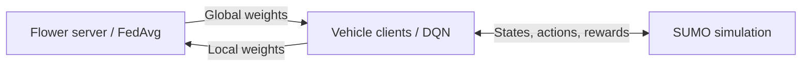

# FLDQN

**Cooperative multi-agent federated reinforcement learning for travel-time minimization in SUMO.**

[](https://doi.org/10.3390/s25030911)
[](https://github.com/WahabMam/FLDQN-Paper-Code)

Research implementation accompanying **FLDQN: Cooperative Multi-Agent Federated Reinforcement Learning for Solving Travel Time Minimization Problems in Dynamic Environments Using SUMO Simulation**.

[Paper](https://doi.org/10.3390/s25030911) · [Companion experiment instructions](https://github.com/nclabteam/sumo-marl) · [Report an issue](https://github.com/WahabMam/FLDQN-Paper-Code/issues)

## Overview

Vehicle agents learn routing policies in SUMO. Flower coordinates model exchange using FedAvg; each client trains a local DQN.



## Setup

```bash
git clone https://github.com/WahabMam/FLDQN-Paper-Code.git
cd FLDQN-Paper-Code
python -m venv .venv
source .venv/bin/activate
```

On Windows, activate with `.venv\Scripts\Activate.ps1` in PowerShell.

Install [SUMO](https://eclipse.org/sumo/) and set `SUMO_HOME` to its installation directory. The original README specifies SUMO **1.14.1**.

The checked-in `requirements.txt` is a legacy environment snapshot, including Ubuntu system packages and conflicting TensorFlow/Keras pins. It is **not a portable installation lockfile**. Key recorded packages are Flower 1.4.0, TensorFlow 2.12.0, NumPy 1.24.3, and Matplotlib 3.7.3. Resolve a compatible environment before running; do not assume a fresh `pip install -r requirements.txt` will succeed.

## Run experiments

Run commands from the repository root **after adapting the paths and settings below**.

### Federated training

1. In `Client_One.py`, replace the absolute `/home/nclab3/...` paths with your local network, route, additional-file, SUMO configuration, and model-output paths.
2. Set episodes, SUMO GUI mode, client count, and starting edges in `config.yaml`. Keep the number of launched clients consistent with the SUMO setup and the server's minimum-client settings.
3. Start the server, then start each client in a separate terminal:

```bash
# Terminal 1: server (currently 50 rounds; waits for 5 clients)
python server.py

# Separate terminal for each ID: 0, 1, 2, 3, 4
python Client_One.py --config config.yaml --vehicle 0
```

The Flower client connects to `127.0.0.1:8080`. The `port: 8088` setting in `config.yaml` belongs to the SUMO configuration; it is not the Flower server address.

### Saved-model evaluation

`dqnrun.py` defaults to `trained = True`. Update the hard-coded checkpoint path in `dqnTrainedAgent.py` to an available, compatible weight file before invoking:

```bash
python dqnrun.py --config config.yaml --vehicle 0
```

`run.sh` starts this entry point for IDs 0–2; it does **not** launch the federated training clients.

## Outputs and reproducibility

- Training CSVs: `Very_Final/`; evaluation CSVs: `New_Final_Testing/`.
- CSV columns: `Episode`, `Waiting_Time`, `Total_Time`, `simu_time`. Consult the code and paper when interpreting these metrics.
- Model output location is set by `dirModel`. Preserve the configuration, checkpoint, dependency versions, seed, and hardware with each experiment.
- The client sets seed value 36, while the standalone entry point samples random seed values. These do not establish fully deterministic execution.

<details>
<summary>Known limitations of this source snapshot</summary>

- The server requires five clients, while the supplied configuration defaults to zero SUMO clients and `run.sh` starts three processes. Align these settings for your experiment.
- Plotting functions in `dqnrun.py` reference `pylab` without importing it. Keep plotting disabled until corrected.
- The evaluation path calls `agent.save_weights()`, but `dqnTrainedAgent` does not define that method; guard that call for training before using evaluation end to end.
- Server/client accuracy and loss callbacks return placeholder zeros; use the experiment outputs rather than those values as performance results.
- This documentation was checked against the source. The full simulation and paper results have not been revalidated for this documentation update.

</details>

## Citation

Please cite the associated paper when using this work:

```bibtex
@article{mamond2025fldqn,
  author = {Mamond, Abdul Wahab and Kundroo, Majid and Yoo, Seong-Eun and Kim, Seonghoon and Kim, Taehong},
  title = {{FLDQN}: Cooperative Multi-Agent Federated Reinforcement Learning for Solving Travel Time Minimization Problems in Dynamic Environments Using {SUMO} Simulation},
  journal = {Sensors},
  year = {2025},
  volume = {25},
  number = {3},
  pages = {911},
  doi = {10.3390/s25030911}
}
```
